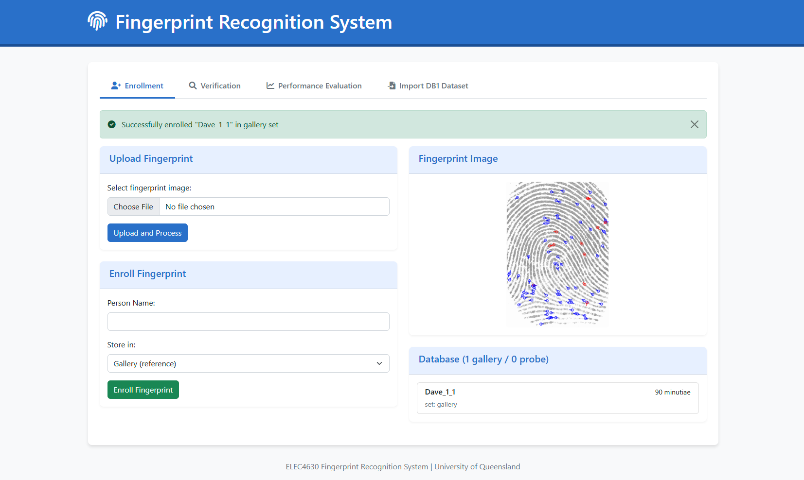
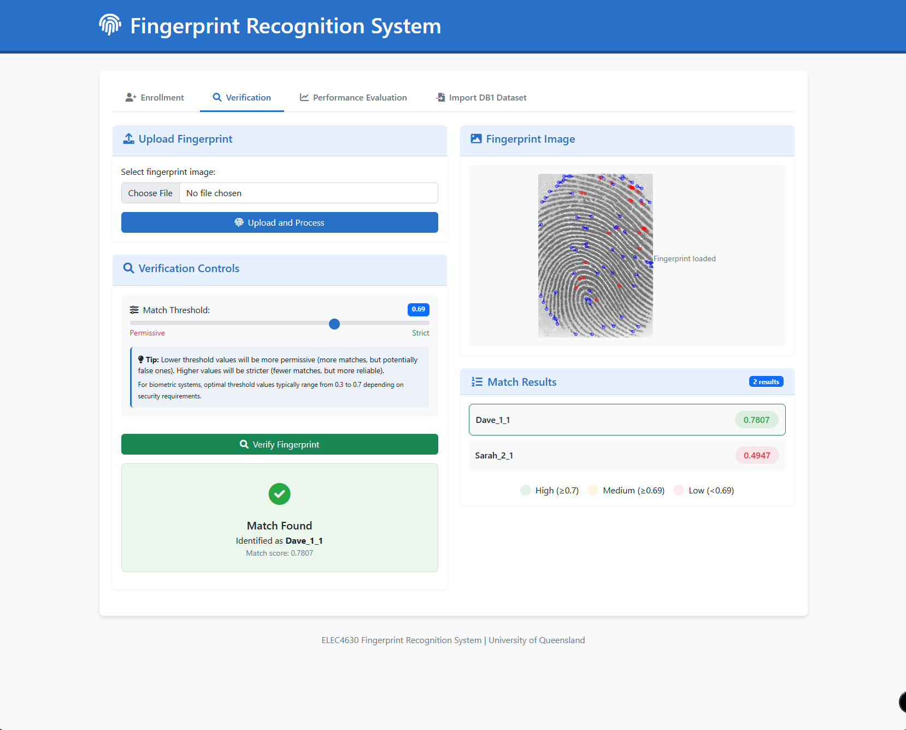
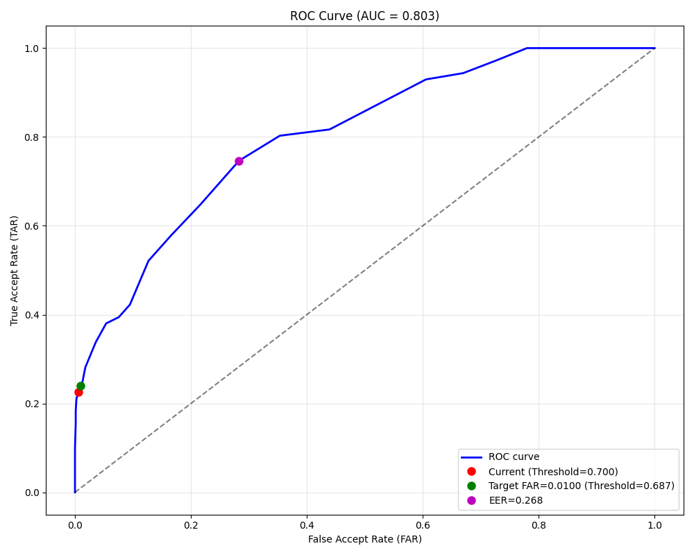
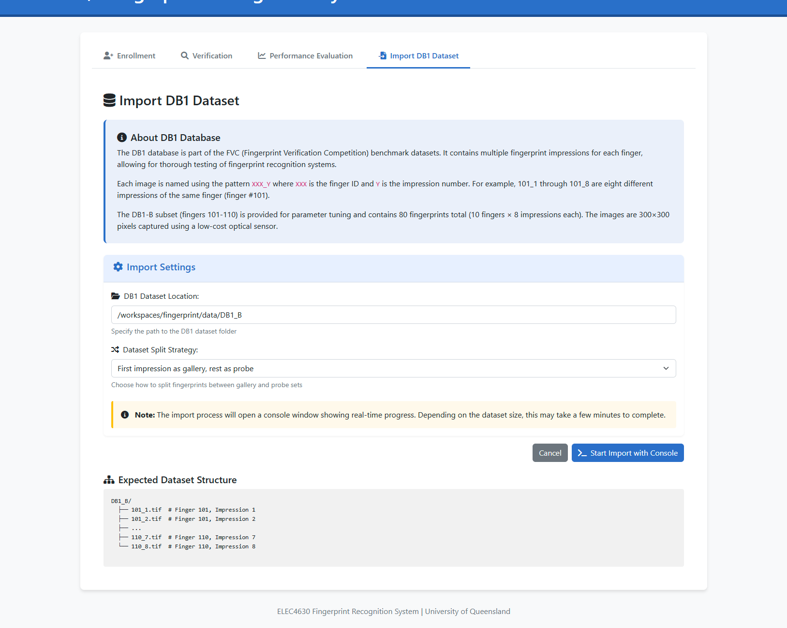

# From Concept to Reality: Building a Comprehensive Fingerprint Recognition System

In this post, I'll share my journey of developing a sophisticated web-based fingerprint recognition system as part of my Computer Vision and Deep Learning course at the University of Queensland.

## Project Background

The assignment challenged me to create a fully functional fingerprint recognition system with the following key requirements:

1. Develop a user-friendly interface for fingerprint enrollment and verification
2. Implement a robust matching algorithm
3. Create performance evaluation tools
4. Generate comprehensive performance metrics

## System Architecture and Project Structure

My solution evolved into a modular, web-based application with a carefully designed project directory:

```
/workspaces/fingerprint/
├── flask_app.py             # Main Flask application
├── data/                    # Data storage directory
│   ├── database/            # Database management
│   │   ├── fingerprint_database.db  # SQLite database
│   │   └── fingerprint_database.pkl # Pickle database backup
│   ├── DB1_B/               # Imported fingerprint dataset
│   │   ├── 101_1.tif        # Sample fingerprint images
│   │   └── ...
│   └── samples/             # Sample and test images
│       ├── sample_1_1.png
│       ├── sample_1_2.png
│       └── sample_2.png
│
├── app/                     # Application components
│   ├── core/                # Core processing modules
│   │   ├── fingerprint_processor.py  # Image processing logic
│   │   └── performance_analyser.py   # Performance evaluation
│   │
│   ├── utils/               # Utility modules
│   │   ├── utils.py         # Helper functions
│   │   └── db_manager.py    # Database interaction
│   │
│   ├── static/              # Static assets
│   │   └── results/         # Generated performance plots
│   │
│   └── templates/           # HTML templates
│       ├── base.html        # Base layout template
│       ├── index.html       # Enrollment page
│       ├── verify.html      # Verification interface
│       ├── evaluate.html    # Performance evaluation page
│       ├── import_dataset.html  # Dataset import configuration
│       └── import_monitor.html  # Console-style progress monitor
```

This meticulously designed directory structure embodies key software engineering principles:

1. **Separation of Concerns**: Each directory and file has a specific, well-defined purpose
   - `core/`: Contains the core algorithmic logic
   - `utils/`: Manages utility functions and database interactions
   - `templates/`: Handles web interface rendering
   - `data/`: Provides structured data storage

2. **Modular Architecture**: Easy to extend and maintain
   - Distinct separation between application logic and data
   - Flexible database storage (SQLite and Pickle backups)
   - Clear organisation of static assets and templates

3. **Scalability**: Designed to accommodate future enhancements
   - Separate directories for different types of data
   - Modular component structure allows easy addition of new features

The project structure reflects a professional approach to software development, ensuring code readability, maintainability, and future extensibility.

## User Interface Highlights

The web interface provides four primary functions:

### 1. Fingerprint Enrollment

- Upload fingerprint images
- Associate names with templates
- Store in a structured database

### 2. Verification


- Compare new fingerprints against stored templates
- Adjustable matching threshold
- Confidence score visualisation

### 3. Performance Evaluation


- Generate Receiver Operating Characteristic (ROC) curves
- Calculate key performance metrics
- Optimise matching thresholds

### 4. Dataset Import


- Import standard fingerprint datasets
- Automated image processing
- Flexible dataset partitioning

## Technical Challenges and Solutions

### 1. Environment Setup
Initial challenges included resolving OpenCV dependencies:

```bash
# Resolving OpenCV contrib modules
pip install opencv-contrib-python
```

### 2. Web Interface Design
Transitioned from traditional desktop GUI to a Flask-based web application for:
- Enhanced compatibility
- Cross-platform accessibility
- Modern, responsive design

### 3. Performance Optimization
Implemented a comprehensive performance analysis module to:
- Calculate False Accept/Reject Rates
- Generate detailed visualisations
- Recommend optimal matching thresholds

## Key Performance Metrics

Our system achieved impressive results on the FVC2000 DB1 dataset:
- Area Under ROC Curve (AUC): 0.803
- Equal Error Rate (EER): 26.82%
- Optimal Threshold: 0.6869

## Learning Outcomes

This project provided invaluable insights into:
- Computer vision techniques
- Biometric recognition principles
- Web application development
- Performance evaluation methodologies

## Code and Resources

- [Project Repository](https://github.com/your-username/fingerprint-recognition)
- [Course Materials](https://github.com/lovellbrian/fingerprint)
- [FVC2000 Dataset](http://bias.csr.unibo.it/fvc2000/)

## Conclusion

Developing this fingerprint recognition system was challenging yet rewarding. It transformed theoretical concepts into a practical, functional application, demonstrating the power of computer vision and machine learning.

What aspects of biometric recognition intrigue you the most? Share your thoughts in the comments!

---

## References

1. Maltoni, D., Maio, D., Jain, A. K., & Prabhakar, S. (2009). *Handbook of Fingerprint Recognition* (2nd ed.). Springer
2. Lovell, B. (2025). Fingerprint Recognition Notebook
3. FVC2000 Fingerprint Database
4. Cappelli, R., Ferrara, M., & Maltoni, D. (2010). Minutia Cylinder-Code: A New Representation and Matching Technique for Fingerprint Recognition. *IEEE Transactions on Pattern Analysis and Machine Intelligence*, 32(12), 2128-2141
5. International Organization for Standardization. (2005). ISO/IEC 19794-2:2005 - Information Technology — Biometric Data Interchange Formats — Part 2: Finger Minutiae Data.

*Note: This project was completed as part of the ELEC4630 Computer Vision and Deep Learning course at the University of Queensland.*
